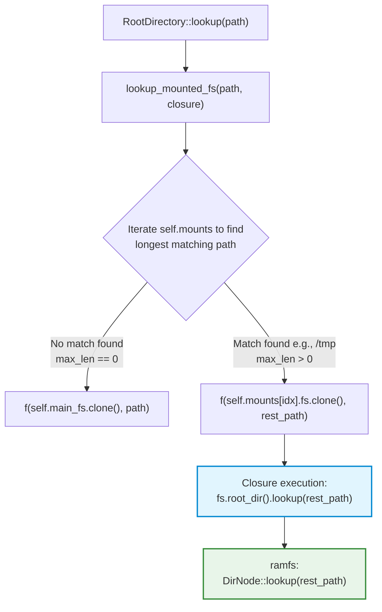
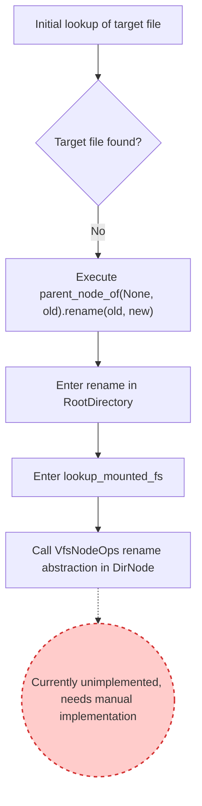

# ArceOS 2026训练营题目解析

## 前言

本文依赖[ArceOS Breakdown of the Startup Process](https://blog.aurobreeze.top/posts/arceos-breakdown-of-the-startup-process.html)，若有部分跳过的地方可以查看此文章。

## 练习

### `print_with_color`

本题的问题很简单，给我们输出的内容上颜色，我们可以随便加一个ASCII的颜色即可通过。

```rust
...
 println!("\x1b[32m[WithColor]: Hello, Arceos!\x1b[0m");
...
```

### `ramfs_rename`

此题的文件挂载流程，`rename`实现调用流程等都在前文中，不再赘述，只讲解`rename`的是实现及思路。

因为最终的调用链会到`modules/axfs/root.rs`下的`pub(crate) fn rename(old: &str, new: &str)`中

```rust
pub(crate) fn rename(old: &str, new: &str) -> AxResult {
    if parent_node_of(None, new).lookup(new).is_ok() {
        warn!("dst file already exist, now remove it");
        remove_file(None, new)?;
    }
    parent_node_of(None, old).rename(old, new)
}
```

`parent_node_of`会根据当前传入的路径(绝对路径或相对路径)，返回当前可操作的`node`，而在本题中，传入是绝对路径`/tmp/f2`，所以会返回可操作的`ROOT_DIR`,也就是根目录

```rust
fn parent_node_of(dir: Option<&VfsNodeRef>, path: &str) -> VfsNodeRef {
    if path.starts_with('/') {
        ROOT_DIR.clone()
    } else {
        dir.cloned().unwrap_or_else(|| CURRENT_DIR.lock().clone())
    }
}
```

返回后会先调用`lookup`的`VfsNodeOps`的抽象，具体实现，就是`ROOT_DIR`所实现的`lookup`

```rust
impl RootDirectory {
	...
    fn lookup_mounted_fs<F, T>(&self, path: &str, f: F) -> AxResult<T>
    where
        F: FnOnce(Arc<dyn VfsOps>, &str) -> AxResult<T>,
    {
        debug!("lookup at root: {}", path);
        let path = path.trim_matches('/');
        if let Some(rest) = path.strip_prefix("./") {
            return self.lookup_mounted_fs(rest, f);
        }

        let mut idx = 0;
        let mut max_len = 0;

        // Find the filesystem that has the longest mounted path match
        // TODO: more efficient, e.g. trie
        for (i, mp) in self.mounts.iter().enumerate() {
            // skip the first '/'
            if path.starts_with(&mp.path[1..]) && mp.path.len() - 1 > max_len {
                max_len = mp.path.len() - 1;
                idx = i;
            }
        }

        if max_len == 0 {
            f(self.main_fs.clone(), path) // not matched any mount point
        } else {
            f(self.mounts[idx].fs.clone(), &path[max_len..]) // matched at `idx`
        }
    }
}


impl VfsNodeOps for RootDirectory {
	...
    fn lookup(self: Arc<Self>, path: &str) -> VfsResult<VfsNodeRef> {
        self.lookup_mounted_fs(path, |fs, rest_path| fs.root_dir().lookup(rest_path))
    }
    fn rename(&self, src_path: &str, dst_path: &str) -> VfsResult {
	    self.lookup_mounted_fs(src_path, |fs, rest_path| {
            if rest_path.is_empty() {
                ax_err!(PermissionDenied) // cannot rename mount points
            } else {
                fs.root_dir().rename(rest_path, dst_path)
            }
        })
    }
    ...
}
```

在调用中，会从`RootDirectory`中`VfsNodeOps`的抽象`lookup`进入到`RootDirectory`的`lookup_mounted_fs`最后进入到`ramfs`的`DirNode`的`lookup`，完成整个`lookup`的调用链。



在`RootDirectory`中实现的`lookp_mounted_fs`中，主要完成的是，对挂载的文件系统的检索，查看是现在要操作的文件系统是哪一个，很显然，在本题中，只挂载了`ramfs`文件系统，当匹配到`/tmp`，就会进入`ramfs`的挂载中，然后进入传入的闭包，也就是`ramfs`中`DirNode`的`lookup`。

> 可以使用`cargo tree`查看开启了什么特性， 挂载了什么文件系统

> 需要注意的就是，在`lookup_mounted_fs`中，会对`path`进行处理，比如看到的`let path = path.trim_matches('/');`，只要两端的字符符合你传入的 `/`，它就会一直往中间"剥"下去，直到遇到第一个不匹配的字符为止。中间匹配的部分是不会被去除的。所以当我们传入`/tmp/f1`时，就会返回`tmp/f1`

```rust
pub struct RamFileSystem {
    parent: Once<VfsNodeRef>,
    root: Arc<DirNode>,
}

impl VfsOps for RamFileSystem {
	...
    fn root_dir(&self) -> VfsNodeRef {
        self.root.clone()
    }
}

impl VfsNodeOps for DirNode {
	...
    fn lookup(self: Arc<Self>, path: &str) -> VfsResult<VfsNodeRef> {
        let (name, rest) = split_path(path);
        let node = match name {
            "" | "." => Ok(self.clone() as VfsNodeRef),
            ".." => self.parent().ok_or(VfsError::NotFound),
            _ => self
                .children
                .read()
                .get(name)
                .cloned()
                .ok_or(VfsError::NotFound),
        }?;

        if let Some(rest) = rest {
            node.lookup(rest)
        } else {
            Ok(node)
        }
    }
    ...
}
```

因为，当前传入的是`/tmp/f2`，并且在`RootDirectory`中已经处理完成，`            f(self.mounts[idx].fs.clone(), &path[max_len..])`，现在传入到`DirNode`中的`path`，已经是`/f2`

所以查找后，并不存在当前文件，所以`rename`执行最后一个`parent_node_of(None, old).rename(old, new)`，和上面一样，会先进入`RootDirectoy`中的`rename`，然后进入`lookup_mounted_fs`，最后就是在`DirNode`中实现的`VfsNodeOps`的抽象，因为当前没有实现，所以需要我们自己增加一个。



在上面中，我们也提到了，`lookup_mounted_fs`中，对`path`的处理仅仅是拿到`/`中间的部分，这中间可能会有很长的路径，所以我们也要处理这一部分的内容

```rust
fn rename(&self, src_path: &str, dst_path: &str) -> VfsResult {
        let (src_name, src_rest) = split_path(src_path);
        if let Some(rest) = src_rest {
            match src_name {
                // recurse on self with the remaining path.
                "" | "." => self.rename(rest, dst_path),
                // get the parent node and recurse.
                ".." => self
                    .parent()
                    .ok_or(VfsError::NotFound)?
                    .rename(rest, dst_path),
                // find the child node and recurse.
                _ => {
                    let child_dir = self
                        .children
                        .read()
                        .get(src_name)
                        .cloned()
                        .ok_or(VfsError::NotFound)?;
                    child_dir.rename(rest, dst_path)
                }
            }
        } else {
            let dst_name = dst_path.rsplit('/').next().unwrap();

            if src_name.is_empty() || src_name == "." || src_name == ".." {
                return Err(VfsError::InvalidInput);
            }
            if dst_name.is_empty() || dst_name == "." || dst_name == ".." {
                return Err(VfsError::InvalidInput);
            }

            let mut child = self.children.write();
            let nodeops = child.remove(src_name).ok_or(VfsError::NotFound)?;
            child.insert(dst_name.into(), nodeops);

            Ok(())
        }

        // Ok(())
    }
```

```rust
    children: RwLock<BTreeMap<String, VfsNodeRef>>
```
在`else`中，通过`rsplit('/').next`获取到可操作节点的父节点，通过读写锁，获取到当前的内容，并重新插入，完成本题。

### `alt_alloc`

> 本题依赖前文，若有跳过部分，请查阅前文。

我们在前文中说过，`alt_alloc`是替代性内存分配器，其所使用的分配功能依赖于`bump_alooc`，在我们第一次运行这个测试时，也是会因为`bump_alloc`的功能没有实现，导致运行错误。

```rust
// modules/alt_alloc/lib.rs
use bump_allocator::EarlyAllocator;
```

这是原文的介绍
```
/// Early memory allocator
/// Use it before formal bytes-allocator and pages-allocator can work!
/// This is a double-end memory range:
/// - Alloc bytes forward
/// - Alloc pages backward
///
/// [ bytes-used | avail-area | pages-used ]
/// |            | -->    <-- |            |
/// start       b_pos        p_pos       end
///
/// For bytes area, 'count' records number of allocations.
/// When it goes down to ZERO, free bytes-used area.
/// For pages area, it will never be freed!
```

所以简单来写的话，我们缺什么补什么即可以完成当前的测试。

根据注释补全`EarlyAllocator`结构体

```rust
pub struct EarlyAllocator<const SIZE: usize> {
    bytes_start: usize,
    b_pos: usize,
    p_pos: usize,
    pages_end: usize,
}
impl<const SIZE: usize> EarlyAllocator<SIZE> {
    pub const fn new() -> Self {
        Self {
            bytes_start: 0,
            b_pos: 0,
            p_pos: 0,
            pages_end: 0,
        }
    }
}
```

这样之后再次运行，会触发报错，补全对应位置

```rust
impl<const SIZE: usize> BaseAllocator for EarlyAllocator<SIZE> {
    fn init(&mut self, start: usize, size: usize) {
        self.bytes_start = start;
        self.b_pos = start;
        self.p_pos = start + size - PAGE_SIZE;
        self.pages_end = start + size;
        // todo!()
	 }
	...
}
 
```

重复上述操作

```rust
impl<const SIZE: usize> ByteAllocator for EarlyAllocator<SIZE> {
    fn alloc(
        &mut self,
        layout: core::alloc::Layout,
    ) -> allocator::AllocResult<core::ptr::NonNull<u8>> {
        // todo!()
        let align_mask = layout.align() - 1;
        let start = (self.b_pos + align_mask) & !align_mask;
        let end = start + layout.size();
        if end > self.p_pos {
            return allocator::AllocResult::Err(allocator::AllocError::NoMemory);
        }
        self.b_pos = end;

        allocator::AllocResult::Ok(core::ptr::NonNull::new(start as *mut u8).unwrap())
    }

    fn dealloc(&mut self, pos: core::ptr::NonNull<u8>, layout: core::alloc::Layout) {
        let need_size = layout.size();
        self.b_pos -= need_size;
        // todo!()
    }
    ...
}
```

因为在这里的`bump_alloc`是最简单的，通过指针指向，表示空闲的空间，所以我们只需要移动标记，同时保持对齐即可。

在这段代码中，并没有处理内存不足的处理，感兴趣还是可以专门补全一下下面的**页分配器**实现，和补充此处`alloc`的内存不足的代码实现。

### `support_hashmap`

还记得在开始想让`ArceOS`运行的时候，遇到了`hashbrown`的版本问题，恰好`hashbrown`

```
This crate is a Rust port of Google's high-performance [SwissTable](https://abseil.io/blog/20180927-swisstables) hash
map, adapted to make it a drop-in replacement for Rust's standard `HashMap`
and `HashSet` types.
```

所以......

```git
-use std::collections::HashMap;
+use hashbrown::HashMap;
```

hhh

### `sys_mmap`

首先要知道`mmap`是用来干什么的，可以通过是`man`来查看`mmap`的具体描述

```rust
DESCRIPTION
     mmap()  creates a new mapping in the virtual address space of the calling process.  The starting address for the new mapping is specified in addr.  The length argu‐
     ment specifies the length of the mapping (which must be greater than 0).

     If addr is NULL, then the kernel chooses the (page-aligned) address at which to create the mapping; this is the most portable method of creating a new mapping.   If
     addr  is  not  NULL, then the kernel takes it as a hint about where to place the mapping; on Linux, the kernel will pick a nearby page boundary (but always above or
     equal to the value specified by /proc/sys/vm/mmap_min_addr) and attempt to create the mapping there.  If another mapping already exists there, the  kernel  picks  a
     new address that may or may not depend on the hint.  The address of the new mapping is returned as the result of the call.

     The  contents  of  a file mapping (as opposed to an anonymous mapping; see MAP_ANONYMOUS below), are initialized using length bytes starting at offset offset in the
     file (or other object) referred to by the file descriptor fd.  offset must be a multiple of the page size as returned by sysconf(_SC_PAGE_SIZE).

     After the mmap() call has returned, the file descriptor, fd, can be closed immediately without invalidating the mapping.
     
     ......
```

> 刚开始做这题的时候我还在想，`sys_mmap`的核心逻辑应该是写在`APP`中，还是应该写到库函数中，然后一开始是打算写在库函数中的，然后发现......这样就导致库函数不是独立的了，需要链接其他的库函数，那这就很不对劲了，以分离为核心的`unikernel`怎么会让库函数之间有如此的关联呢，那就是思路出问题了，就是需要写到`APP`中的。

整体的实现思路上，就是通过寻找当前进程的空闲空间，寻找合适的空闲位置，映射空间并将文件内容写入被映射到地址上。

不过需要注意到是，因为这里使用了`axtask`，在原本的`TaskInner`中并没有管理地址空间的内容，而是由自己进行扩展到，也就是在本题中，给出的`sys_map/src/task.rs`的`TaskExt`扩展。

在`axtask`中`TaskInner`的`task_ext`实际是一个指针，用于后续实现具体的扩展。而实现扩展到方法就是在`task_ext.rs`中的`def_task_ext`宏定义，通过将`TaskExt`的扩展和定义的`TaskExtRef trait`和`TaskExtMut trait`来实现对`TaskInner`中的`task_ext`的获取，赋予扩展极高的灵活性和便利性。

```rust
// sys_map/src/task.rs
axtask::def_task_ext!(TaskExt);
```


在扩展中，实现了我们需要的`aspace`。

```rust
fn sys_mmap(
    addr: *mut usize,
    length: usize,
    prot: i32,
    flags: i32,
    fd: i32,
    _offset: isize,
) -> isize {
    syscall_body!(sys_mmap, {
        let prot = MmapProt::from_bits(prot).ok_or(LinuxError::EINVAL)?;
        let mmap_flags = MmapFlags::from_bits(flags).unwrap();
        let mapping_flags = prot.into();

        let curr = axtask::current();
        let mut aspace = curr.task_ext().aspace.lock();

        let aligned_length = (length + 0xfff) & !0xfff;

        let start = aspace
            .find_free_area(
                memory_addr::va!(0x10000),
                aligned_length,
                memory_addr::VirtAddrRange::from_start_size(aspace.base(), aspace.size()),
            )
            .ok_or(LinuxError::ENOMEM)?;

        aspace.map_alloc(start, aligned_length, mapping_flags, true)?;

        if !mmap_flags.contains(MmapFlags::MAP_ANONYMOUS) && fd >= 0 {
            let mut buf = [0u8; 4096];
            let read_len = length.min(4096);
            let n = api::sys_read(fd, buf.as_mut_ptr() as *mut c_void, read_len);
            if n > 0 {
                aspace.write(start, &buf[..n as usize])?;
            }
        }

        Ok(start.as_usize())
    })
}
```

所以在具体的实现中，从`aspace`中获取合适的地址空间进行映射，并将文件内容写入到映射到空间中。

> 当然这里的代码并不是很完善，还是有优化的空间的，我比较懒....写个TODO得了.....hhh


