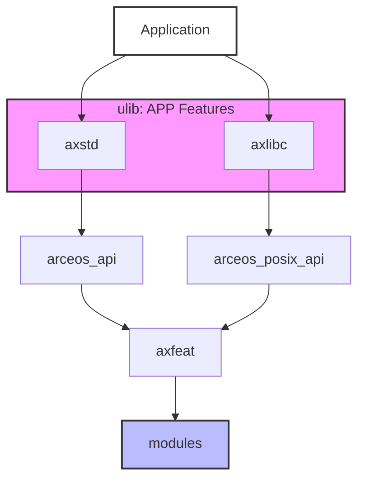
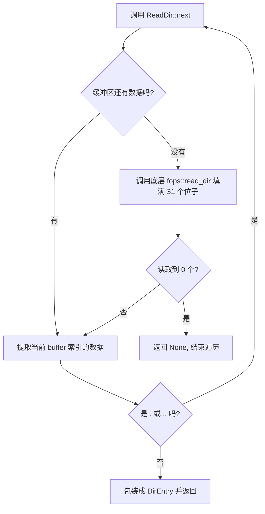
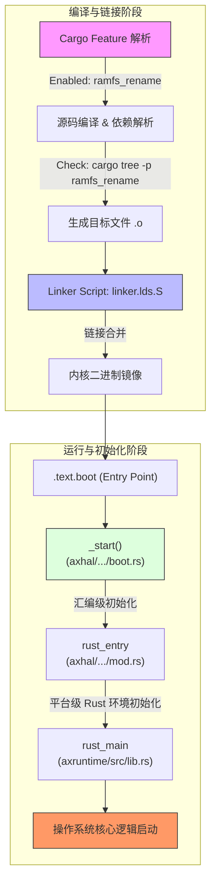
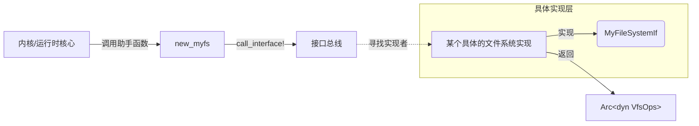
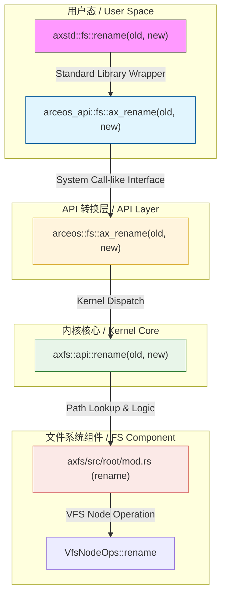

 
# Arceos 启动流程拆解

## 前言

> 注：本文默认读者已具备基础的 RISC-V 体系结构及常规操作系统理论知识，底层硬件常识将不再赘述。

于我而言，写项目前，完整了解项目前期的启动及相关的内容是及其必要，可以完整了解整个项目的运转方式，掌握开发流程。

所以下文是简单的对`ArceOS`的架构解析，只针对`RISCV`。

--- 

## Makefile分析

> `ArceOS`并不是一个大型或者中型的项目，所以，可以直接来通过`Makefile`来分析整个项目的构建流程和启动流程。

`Makefile`文件在项目的根目录下和`scripts/make/`目录下

```makefile
# scripts/make/build.mk
_cargo_build:
	@printf "    $(GREEN_C)Building$(END_C) App: $(APP_NAME), Arch: $(ARCH), Platform: $(PLATFORM_NAME), App type: $(APP_TYPE)\n"
ifeq ($(APP_TYPE), rust)
	$(call cargo_build,$(APP),$(AX_FEAT) $(LIB_FEAT) $(APP_FEAT))
	@cp $(rust_elf) $(OUT_ELF)
else ifeq ($(APP_TYPE), c)
	$(call cargo_build,ulib/axlibc,$(AX_FEAT) $(LIB_FEAT))
endif
```

```makefile
# scripts/make/cargo.mk
define cargo_build
  $(call run_cmd,cargo -C $(1) build,$(build_args) --features "$(strip $(2))")
endef
```

```makefile
# scripts/make/features.mk
ifeq ($(APP_TYPE),c)
  ax_feat_prefix := axfeat/
  lib_feat_prefix := axlibc/
  lib_features := fp_simd irq alloc multitask fs net fd pipe select epoll
else
  # TODO: it's better to use `axfeat/` as `ax_feat_prefix`, but all apps need to have `axfeat` as a dependency
  ax_feat_prefix := axstd/
  lib_feat_prefix := axstd/
  lib_features :=
endif

override FEATURES := $(shell echo $(FEATURES) | tr ',' ' ')

ifeq ($(APP_TYPE), c)
  ifneq ($(wildcard $(APP)/features.txt),)    # check features.txt exists
    override FEATURES += $(shell cat $(APP)/features.txt)
  endif
  ifneq ($(filter fs net pipe select epoll,$(FEATURES)),)
    override FEATURES += fd
  endif
endif

override FEATURES := $(strip $(FEATURES))

ax_feat :=
lib_feat :=

...
...

ax_feat += $(filter-out $(lib_features),$(FEATURES))
lib_feat += $(filter $(lib_features),$(FEATURES))

AX_FEAT := $(strip $(addprefix $(ax_feat_prefix),$(ax_feat)))
LIB_FEAT := $(strip $(addprefix $(lib_feat_prefix),$(lib_feat)))
APP_FEAT := $(strip $(shell echo $(APP_FEATURES) | tr ',' ' '))
```

在这里面，这是负责编译整个内核代码的部分

> 需要注意的是，在`makefile`文件中，并没有直接的将`modules\`文件夹放入到`cargo`中编译，因为`Rust`采用的依赖来进行编译，这也就是为什么我会在上图中将`features.mk`的代码也会拿出来，所以正常在编译`rust`内核的时候，都会选选择`axstd/`，我们就可以使用`cargo tree -p axstd`进行查看，当然，因为`features`可选的缘故，那些没有选择的模块并不会出现在树形图中，具体可以看`axfeat`的`Cargo.toml`

> 在`ArceOS`中，`axfeat`作为顶层的特性选择，是通过`Cargo.toml`的特性传递来实现最终到`axfeat`的，比如其中的`axstd/Cargo.toml`中的`fs = ["arceos_api/fs", "axfeat/fs"]`，就会传递到`axfeat/`中，因此最后的编译器会根据依赖进行编译`axfeat`。
> 具体的特性传递，可以查阅官方的[Cargo手册](https://doc.rust-lang.org/cargo/index.html)中的[features](https://doc.rust-lang.org/cargo/reference/features.html)部分

---

## 启动流程

启动的代码部分被放在了架构抽象层`modules/axhal`中，因为`OS`代码并不是普通的执行文件，所以需要**链接器**来规划地址空间。

```ld
    .text : ALIGN(4K) {
        _stext = .;
        *(.text.boot)
        *(.text .text.*)
        . = ALIGN(4K);
        _etext = .;
    }
```

对于`ELF`文件的解析，具体查阅[System V Application Binary Interface](https://refspecs.linuxfoundation.org/elf/gabi4+/contents.html)

通常来说，为了区分启动函数的代码，和其他的代码，启动函数代码一般都会使用一个区别于纯`.text`的名字，在这里就是**.text.boot**，我们可以通过搜索找到对应的启动代码。

```rust
// modules/axhal/src/platform/riscv64-qemu-vire/boot.rs

/// The earliest entry point for the primary CPU.
#[naked]
#[no_mangle]
#[link_section = ".text.boot"]
unsafe extern "C" fn _start() -> ! {
	...
	entry = sym super::rust_entry,
	...
}
```

再通过搜索`rust_entry`找下一阶段的代码，同理，最后我们就会找到`modules/axruntime/src/lib.rs`最后使用的`rust_main`的`OS`初始化流程及启动代码

```rust
// modules/axruntime/src/lib.rs

extern "C" {
    fn main();
}

#[cfg_attr(not(test), no_mangle)]
pub extern "C" fn rust_main(cpu_id: usize, dtb: usize) -> ! {
...
    unsafe { main() };
...
}
```

在这里启动的`main`就是我们一般要进行测试时使用的`app`中的main，至此`OS`的启动就完成了。

> 关于为什么`main`是`app`中的，如果你检索一下`modules`库，你就会发现，`modules`中并没有专门的`main`来运行和管理一个`OS`，而且这也就是`ArceOS`的`Unikernel`的设计思路，以库为核心，通过拆分功能，以实现组件化的内核，而且运行时都是在`Supervisor-Level`特权级下。

> 当然，具体的审阅为什么`main`是我们编译的`app`中的，还是要看`makefile`文件，`$(call cargo_build,$(APP),$(AX_FEAT) $(LIB_FEAT) $(APP_FEAT))`，其中的`APP`就是我们在编译时选择`APP`或`A`的路径。

---

## 顶层设计

在整体的框架中`ulib`中存放`APP`需要的功能，同时`ulib`中的`axstd`和`axlibc`都是依赖于`axfeat`的，其中`axstd`依赖`arceos_api`，`axlibc`依赖`arceos_posix_api`，`arceos_api`和`arceos_poxis_api`依赖`modules`

所以就可以画出这样的图：




---

## 库模块

整个`ArceOS`中**最核心**的代码，都是在`modules`中的。

- modules
	- `alt_alloc`: 替代内存分配器
	- `axalloc`: 内存分配器
	- `axfs`： 文件系统
	- `axhal`: 硬件抽象代码
	- `axmm`： 地址空间管理
	- `bump_allocator`: 早期内存分配器
	- `axruntime`: 系统初始化构建

> 只放置了我看了的库，其他的模块还没看

---

### `axhal`

在这个库中，包含了硬件相关和硬件无关的代码，以及系统的启动，初始化和设置。

这里只说一下经常用到的。

其中，`src/arch/`目录下是硬件相关的代码，也就是硬件相关，在`src/`下的`rs`文件则是硬件无关的代码。

- `arch/riscv/`
	- `context.rs`: 包含了中断处理，上下文切换，设置页表，切换任务，进入用户空间等硬件相关的操作
	- `mod.rs`: 包含设置中断向量，启用禁止中断，停机，刷新`TLB`等硬件相关操作
	- `trap.rs`: 包含中断处理，缺页处理
- `platform/riscv64`
	- `boot.rs`: 包含硬件相关的初始化分页，和系统启动及设置
	- `mod`： 包含进入`rust_main`的处理
- `mem.rs`: 包含硬件无关`VA --> PA`和`PA --> VA`，物理地址空间结构体，默认空闲空间和默认`mmio`映射空间
- `paging.rs`: 包含硬件无关的获取页表，设置页表，分页处理等
- `trap.rs`: 包含硬件无关的中断处理，和系统调用分发

---

### `bump_allocator`

> 操作系统在初始化前期，还在处于一个**鸡生蛋，还是蛋生鸡**的问题上，也就是，你想要启用分页，但是启用分页需要页表，页表本身又占用内存空间，如果你还没有页表和内存管理器，你从哪里申请空间来存放这些页表？然后就卡住了，解决办法也很简单，用一个最简单的方式来建立一个不怎么正规，但要合理且易用的内存分配器，也就是早期分配器。

早期分配器的设计思路也很简单，我就直接把`bump_allocator`的注释拿过来了。

```rust
// modules/bump_allocator/src/lib.rs

/// Early memory allocator
/// Use it before formal bytes-allocator and pages-allocator can work!
/// This is a double-end memory range:
/// - Alloc bytes forward
/// - Alloc pages backward
///
/// [ bytes-used | avail-area | pages-used ]
/// |            | -->    <-- |            |
/// start       b_pos        p_pos       end
///
/// For bytes area, 'count' records number of allocations.
/// When it goes down to ZERO, free bytes-used area.
/// For pages area, it will never be freed!
```


设计思路就是，找一块空闲的地址，低地址放`bytes-used`，高地址放`page-used`，两边向中间增长。

所以，这样就可以了。
```rust
// modules/bump_allocator/src/lib.rs

pub struct EarlyAllocator<const SIZE: usize> {
    bytes_start: usize,
    b_pos: usize,
    p_pos: usize,
    pages_end: usize,
}
```

> 关于为什么`For pages area, it will never be freed!`,主要是，OS启动后会开启分页，后在初始化的阶段，使用了`alt_alloc`分配内存映射内核代码，所以要是`Free`直接炸了。
> 
> >`alt_alloc`依赖`bump_allocator`进行管理内存

#### 一点额外的内容

在`ArceOS`中，似乎并没有体现出对`alt_alloc`的用处，在特性选择的时候，可以选择`alt_alloc`或者是`alloc`，不管选择什么特性，OS在初始化中都是在同一个地方进行初始化，而且他们区别仅在于内存分配器的选择。

```rust
pub extern "C" fn rust_main(cpu_id: usize, dtb: usize) -> ! {
...
	info!("Found physcial memory regions:");
    for r in axhal::mem::memory_regions() {
        info!(
            "  [{:x?}, {:x?}) {} ({:?})",
            r.paddr,
            r.paddr + r.size,
            r.name,
            r.flags
        );
    }

    #[cfg(any(feature = "alloc", feature = "alt_alloc"))]
    init_allocator();
...
}

#[cfg(feature = "alloc")]
fn init_allocator() {
    use axhal::mem::{memory_regions, phys_to_virt, MemRegionFlags};
...
	    axalloc::global_init(phys_to_virt(r.paddr).as_usize(), r.size);
        
		axalloc::global_add_memory(phys_to_virt(r.paddr).as_usize(),r.size)
				
				.expect("add heap memory region failed");
...
}

#[cfg(feature = "alt_alloc")]
fn init_allocator() {
...
            alt_axalloc::global_init(phys_to_virt(r.paddr).as_usize(), r.size);

            alt_axalloc::global_add_memory(phys_to_virt(r.paddr).as_usize(), r.size)
                .expect("add heap memory region failed");
...
```


从上面的代码也可以看出来，仅仅是改变了一下内存分配器的选择。

核心原因： `ArceOS`使用的**恒等映射**的策略，也就是`Virtual Address`=`Physical address`

如果我们查看，启动流程中的`axhal/linker.lds.S`中的链接器设置，`axhal/src/mem.rs`中内核地址设计和`rust_main`中的地址映射

```ld
# const KERNEL_BASE: usize = 0x8020_0000;

BASE_ADDRESS = %KERNEL_BASE%;
```

```rust
/// Returns the memory regions of the kernel image (code and data sections).
fn kernel_image_regions() -> impl Iterator<Item = MemRegion> {
    [
        MemRegion {
            paddr: virt_to_phys((_stext as usize).into()),
            size: _etext as usize - _stext as usize,
            flags: MemRegionFlags::RESERVED | MemRegionFlags::READ | MemRegionFlags::EXECUTE,
            name: ".text",
        },
        MemRegion {
            paddr: virt_to_phys((_srodata as usize).into()),
            size: _erodata as usize - _srodata as usize,
            flags: MemRegionFlags::RESERVED | MemRegionFlags::READ,
            name: ".rodata",
        },
        MemRegion {
            paddr: virt_to_phys((_sdata as usize).into()),
            size: _edata as usize - _sdata as usize,
            flags: MemRegionFlags::RESERVED | MemRegionFlags::READ | MemRegionFlags::WRITE,
            name: ".data .tdata .tbss .percpu",
        },
        MemRegion {
            paddr: virt_to_phys((boot_stack as usize).into()),
            size: boot_stack_top as usize - boot_stack as usize,
            flags: MemRegionFlags::RESERVED | MemRegionFlags::READ | MemRegionFlags::WRITE,
            name: "boot stack",
        },
        MemRegion {
            paddr: virt_to_phys((_sbss as usize).into()),
            size: _ebss as usize - _sbss as usize,
            flags: MemRegionFlags::RESERVED | MemRegionFlags::READ | MemRegionFlags::WRITE,
            name: ".bss",
        },
    ]
    .into_iter()
}
```

就可以发现，只是使用了**恒等映射**，在这种情况下，可以正常的将内存分配到内存管理器当中使用，并无不妥。

倘若是使用**高地址映射**，如是在开启分页前将所有的内存管理起来，那么开启分页后，这些在前面获取到的内存地址就都是`Low Vritual Address`，这些地址并没有进行映射，我们只映射了高地址空间，那么我们后面想要分配内存的时候，如果是需要`VA`那么还需要我们自己手动使用`Physical Address to Virtual Address`转换到我们已经映射到区域，这样就很不方便了，所以使用`bump_alloc`就不会有这么多问题，会很方便。

---

### `alt_axalloc`

> `alt_axalloc` == `Alternative Allocator`

简单看一下，`alt_axalloc`的依赖，我们上面也提到了`alt_axalloc`依赖`bump_alloc`

```rust
// alt_axalloc/Cargo.toml
allocator = { git = "https://github.com/arceos-org/allocator.git", tag ="v0.1.0", features = ["bitmap"] }
bump_allocator = { path = "../bump_allocator" }
```

`alt_alloc`更多的是对`bump_alloc`的可用封装，并向外提供内存管理的功能，在这里并没有什么需要多说的地方。

---

### `axalloc`

在`src/lib.rs`中实现的内存分配器主要的作用还是还是用来处理在`rust`中的内存分配，它是实现了`Vec`等数据结构所需的`global_allocator`，极其方法

```rust
// src/lib.rs

unsafe impl GlobalAlloc for GlobalAllocator {
    unsafe fn alloc(&self, layout: Layout) -> *mut u8 {
        if let Ok(ptr) = GlobalAllocator::alloc(self, layout) {
            ptr.as_ptr()
        } else {
            alloc::alloc::handle_alloc_error(layout)
        }
    }

    unsafe fn dealloc(&self, ptr: *mut u8, layout: Layout) {
        GlobalAllocator::dealloc(self, NonNull::new(ptr).expect("dealloc null ptr"), layout)
    }
}
```

在`src/page.rs`中实现的是页分配器，主要的作用还是用来进行地址映射，以及需要的大空间映射。

具体的实现可以参阅具体代码，并没有什么需要说明的部分。

---


### `axmm`

基于`axalloc`的页表地址空间管理库

```rust
// axmm/Cargo.toml
[dependencies]
axhal = { workspace = true, features = ["paging"] }

// axhal/Cargo.toml
[features]
paging = ["axalloc", "page_table_multiarch"]
```

- `src`
	- `backend/`: 具体实现代码
		- `alloc.rs`: 包含使用`axalloc`来进行页级的映射地址，和取消映射 
		- `linear`: 包含使用外部库进行连续的地址映射，支持页级映射和大页映射
		- `mod.rs`: 将`alloc.rs`和`linear`上的映射的具体实现，封装到`MappingBackend trait`中
	- `aspace.rs`： 基于`backend`封装的映射函数，实现的虚拟空间管理
	- `lib.rs`: 包含创建新的用户空间，内核空间，映射内核空间等等


```rust
// axmm/src/backend/alloc.rs

fn alloc_frame(zeroed: bool) -> Option<PhysAddr> {
    let vaddr = VirtAddr::from(global_allocator().alloc_pages(1, PAGE_SIZE_4K).ok()?);
    if zeroed {
        unsafe { core::ptr::write_bytes(vaddr.as_mut_ptr(), 0, PAGE_SIZE_4K) };
    }
    let paddr = virt_to_phys(vaddr);
    Some(paddr)
}
```

> `alloc.rs`通过使用全局分配器`axalloc`或`alt_alloc`的`allloc_page`来获取内存使用

```rust
// axmm/src/backend/mod.rs

#[derive(Clone)]
pub enum Backend {
    Linear {pa_va_offset: usize,},
    Alloc {populate: bool,},
}

impl MappingBackend for Backend {
    type Addr = VirtAddr;
    type Flags = MappingFlags;
    type PageTable = PageTable;
    fn map(&self, start: VirtAddr, size: usize, flags: MappingFlags, pt: &mut PageTable) -> bool {
        match *self {
            Self::Linear { pa_va_offset } => self.map_linear(start, size, flags, pt, pa_va_offset),
            Self::Alloc { populate } => self.map_alloc(start, size, flags, pt, populate),
        }
    }

    fn unmap(&self, start: VirtAddr, size: usize, pt: &mut PageTable) -> bool {
        match *self {
            Self::Linear { pa_va_offset } => self.unmap_linear(start, size, pt, pa_va_offset),
            Self::Alloc { populate } => self.unmap_alloc(start, size, pt, populate),
        }
    }
    ...
}
```

在`mod.rs`中，实现了`MappingBackend trait`，通过使用`alloc.rs`和`linear.rs`中的对应的映射函数完成。

而`mod.rs`中的`MappingBackend trait`又是为了`memory_set`库中的`map_area`和`map`服务的，也就是**为`AddrSpace`中的`areas: MemorySet<Backend>` 服务**，所涉及的代码如下：

```rust
// axmm/src/aspace.rs

pub struct AddrSpace {
    va_range: VirtAddrRange,
    areas: MemorySet<Backend>,
    pt: PageTable,
}
```

```rust
// axmm/src/aspace.rs

pub fn map_alloc(
        &mut self,
        start: VirtAddr,
        size: usize,
        flags: MappingFlags,
        populate: bool,
    ) -> AxResult {
...
        let area = MemoryArea::new(start, size, flags, Backend::new_alloc(populate));
        self.areas
            .map(area, &mut self.pt, false)
            .map_err(mapping_err_to_ax_err)?;
...
    }
```

> 其中：`self.areas.map(area, &mut self.pt, false).map_err(mapping_err_to_ax_err)?;`的`map`会调用`map_area`最后会调用我们所实现的`Backend`中的`map`函数
> 
> 关于`Backend`实现的`unmap`函数，我并没有发现在什么地方使用，可能会在更深的地方调用

关于其他的调用建立新的页表，复制页表，寻找空闲空间，连续映射，页映射，取消映射，读地址，写地址等，就不再赘述了。

---

### `axfs`

`axfs`可能是要介绍的这几个库中最麻烦的几个了。

整个`axfs`的核心都是在`root.rs`和`fops.rs`两个文件上

- `api`:
	- `file.rs`: 基于`OpenOption::opne()`及`fops::File`的文件的打开，写入，创建等操作。以及获取元数据等信息
	- `dir.rs`： 实现了文件系统中的目录操作，读取目录内容以及创建新目录
	- `mod.rs`： 向外提供目录的读取，创建，删除，文件的读取，写入，重命名等操作
- `fs`:
	- `fatfs.rs`： FAT文件系统
	- `myfs`
	- `mod.rs`
- `dev.rs`： 底层驱动的适配层
- `fops.rs`： 定义了文件，目录和打开的权限，以及基于`ROOT_DIR`及`axvfs_ops`的打开文件，读取，写入，刷新等操作
- `lib.rs`：初始化文件系统
- `mounts.rs`： 各文件系统的挂载
- `root.rs`： 实现根目录的挂载及节点的相关操作，同时基于初始化完成后的`ROOT_DIR`提供获取绝对路径，搜索，创建，删除，重命名文件等功能

`fops.rs`我认为是首先需要查阅的

在`fops.rs`中定义了`File`和`Directory`结构体，以及文件打开后持有的权限`OpenOption`

```rust
// src/fops.rs
pub struct File {
    node: WithCap<VfsNodeRef>,
    is_append: bool,
    offset: u64,
}
pub struct Directory {
    node: WithCap<VfsNodeRef>,
    entry_idx: usize,
}
```

在结构体中需要注意的就是`File`和`Directory`都是持有`node`节点的，他们的所有的操作都是基于`VfsNodeRef`的

而在`axvfs`中`pub type VfsNodeRef = Arc<dyn VfsNodeOps>;`。

```rust
// src/fops.rs
impl File {
	...
    fn access_node(&self, cap: Cap) -> AxResult<&VfsNodeRef> {
        self.node.access_or_err(cap, AxError::PermissionDenied)
    }
    ...
}
```

`access_node`就是获取节点的函数，后续涉及到`vfs`的操作(文件或目录操作)，都是需要先通过此函数获取对应的可操作节点。

```rust
// src/fops.rs
impl File {
	...
    pub fn read(&mut self, buf: &mut [u8]) -> AxResult<usize> {
        let node = self.access_node(Cap::READ)?;
        let read_len = node.read_at(self.offset, buf)?;
        ...
        Ok(read_len)
    }
    pub fn read_at(&self, offset: u64, buf: &mut [u8]) -> AxResult<usize> {
        let node = self.access_node(Cap::READ)?;
        let read_len = node.read_at(offset, buf)?;
        ...
    }
	...
}
```

> 所以在诸如此类`node.read`的代码中，他们的导向就是`VFS`的抽象，最终在运行时，由实际的文件系统提供此类操作以实现`File`或`Directory`中实现的功能


而`Directory`与`File`不同的是，`Directory`中的部分操作是直接关联的`root.rs`中的`ROOT_DIR`的，接下来我们再看`root.rs`

```rust
// src/root.rs
static CURRENT_DIR_PATH: Mutex<String> = Mutex::new(String::new());
static CURRENT_DIR: LazyInit<Mutex<VfsNodeRef>> = LazyInit::new();
struct MountPoint {
    path: &'static str,
    fs: Arc<dyn VfsOps>,
}
struct RootDirectory {
    main_fs: Arc<dyn VfsOps>,
    mounts: Vec<MountPoint>,
}

static ROOT_DIR: LazyInit<Arc<RootDirectory>> = LazyInit::new();
```


```rust
impl RootDirectory {
    pub const fn new(main_fs: Arc<dyn VfsOps>) -> Self 
    pub fn mount(&mut self, path: &'static str, fs: Arc<dyn VfsOps>) -> AxResult 
    pub fn _umount(&mut self, path: &str)
    pub fn contains(&self, path: &str) -> bool
    fn lookup_mounted_fs<F, T>(&self, path: &str, f: F) -> AxResult<T>
}
```

在实现的`RootDirectory`中，`main_fs`是主文件系统，在`mounts`中是挂载的文件系统，可以挂载多个，就像是U盘，临时的文件系统等

```rust
impl VfsNodeOps for RootDirectory {
    axfs_vfs::impl_vfs_dir_default! {}
    fn get_attr(&self) -> VfsResult<VfsNodeAttr>
    fn lookup(self: Arc<Self>, path: &str) -> VfsResult<VfsNodeRef>
    fn create(&self, path: &str, ty: VfsNodeType) -> VfsResult
    fn remove(&self, path: &str) -> VfsResult
    fn rename(&self, src_path: &str, dst_path: &str) -> VfsResult
}
```

在实现`VfsNodeOps`中，`fs.root_dir()`等操作是使用的`VfsOps`抽象，也就是由挂载的文件系统实现的`VfsOps`提供具体实现。

所以本质上在`RootDirectory`上实现的`VfsNodeOps`的调用路径就是


```rust
fn parent_node_of(dir: Option<&VfsNodeRef>, path: &str) -> VfsNodeRef {
    if path.starts_with('/') {
        ROOT_DIR.clone()
    } else {
        dir.cloned().unwrap_or_else(|| CURRENT_DIR.lock().clone())
    }
}
```

剩下的代码最重要的实现就是`parent_node_of`是专门用来获取解析的`VfsNodeRef`的基点，如果是`/`则是绝对路径，否则就是相对路径，给我们解析出对应的可用的`VfsNodeRef`

```rust
// src/api/file.rs
pub struct File {
    inner: fops::File,
}
pub struct OpenOptions(fops::OpenOptions);

impl OpenOptions {
	...
    /// Opens a file at `path` with the options specified by `self`.
    pub fn open(&self, path: &str) -> Result<File> {
        fops::File::open(path, &self.0).map(|inner| File { inner })
    }
    ...
}

impl File {
    pub fn open(path: &str) -> Result<Self> 
    pub fn create(path: &str) -> Result<Self>
    pub fn create_new(path: &str) -> Result<Self>
    pub fn options() -> OpenOptions
    pub fn set_len(&self, size: u64) -> Result<()> 
    pub fn metadata(&self) -> Result<Metadata> 
}
```

在`src/file.rs`中，`OpenOptions`实现的函数除`open`外都是会返回自身的，所以最后在实现`File`的时候，是通过设置`OpenOptions`权限后，用`OpenOptions::open`进行打开文件。

而在`src/api/dir.rs`中的代码的核心作用就是实现目录迭代器和目录构造器，而当前的目录构造器中，只实现了`create_dir`



---

## 启动示例

这里以`ramfs_rename`示例来讲解整个流程的启动

```rust
[features]
default = ["axstd/myfs", "dep:axfs_vfs", "dep:axfs_ramfs", "dep:crate_interface"]

[dependencies]
axfs_vfs = { version = "0.1", optional = true }
axfs_ramfs = { version = "0.1", optional = true }
crate_interface = { version = "0.1", optional = true }
axstd = { workspace = true, features = ["alloc", "fs"], optional = true }
```

这是示例文件的`Cargo.toml`， 通过特性解析，`Cargo`会将对应的开启的特性进行编译，可以通过`Cargo tree -p ramfs_rename`来查看。



在`rust_main`初始化过程中

```rust
fn init_allocator() {
    use axhal::mem::{memory_regions, phys_to_virt, MemRegionFlags};

    info!("Initialize global memory allocator...");
    info!("  use {} allocator.", axalloc::global_allocator().name());

    let mut max_region_size = 0;
    let mut max_region_paddr = 0.into();
    for r in memory_regions() {
        if r.flags.contains(MemRegionFlags::FREE) && r.size > max_region_size {
            max_region_size = r.size;
            max_region_paddr = r.paddr;
        }
    }
    for r in memory_regions() {
        if r.flags.contains(MemRegionFlags::FREE) && r.paddr == max_region_paddr {
            axalloc::global_init(phys_to_virt(r.paddr).as_usize(), r.size);
            break;
        }
    }
    for r in memory_regions() {
        if r.flags.contains(MemRegionFlags::FREE) && r.paddr != max_region_paddr {
            axalloc::global_add_memory(phys_to_virt(r.paddr).as_usize(), r.size)
                .expect("add heap memory region failed");
        }
    }
}
```

初始化全局分配器，首先找到标记为`Free`的最大的空闲区域，然后进行初始化，最后将所有的空闲的空间再全部加入到分配器中。

```rust
pub fn init_memory_management() {
    info!("Initialize virtual memory management...");

    let kernel_aspace = new_kernel_aspace().expect("failed to initialize kernel address space");
    debug!("kernel address space init OK: {:#x?}", kernel_aspace);
    KERNEL_ASPACE.init_once(SpinNoIrq::new(kernel_aspace));
    axhal::paging::set_kernel_page_table_root(kernel_page_table_root());
}
```

然后建立内核页表，进行内核代码映射，并开启分页

```rust
/// Initializes filesystems by block devices.
pub fn init_filesystems(mut blk_devs: AxDeviceContainer<AxBlockDevice>) {
    info!("Initialize filesystems...");

    let dev = blk_devs.take_one().expect("No block device found!");
    info!("  use block device 0: {:?}", dev.device_name());
    self::root::init_rootfs(self::dev::Disk::new(dev));
}
```

然后建立文件系统，在建立文件系统的时候，会调用`init_rootfs`，因为在本次的代码中，使用了`myfs`，所以会在

```rust
pub(crate) fn init_rootfs(disk: crate::dev::Disk) {
    cfg_if::cfg_if! {
        if #[cfg(feature = "myfs")] { // override the default filesystem
            let main_fs = fs::myfs::new_myfs(disk);
        } else if #[cfg(feature = "fatfs")] {
            static FAT_FS: LazyInit<Arc<fs::fatfs::FatFileSystem>> = LazyInit::new();
            FAT_FS.init_once(Arc::new(fs::fatfs::FatFileSystem::new(disk)));
            FAT_FS.init();
            let main_fs = FAT_FS.clone();
        }
    }
	...
}
```

初始化`myfs`文件系统，而具体的`myfs`的代码实现

```rust
/// The interface to define custom filesystems in user apps.
#[crate_interface::def_interface]
pub trait MyFileSystemIf {
    /// Creates a new instance of the filesystem with initialization.
    ///
    /// TODO: use generic disk type
    fn new_myfs(disk: Disk) -> Arc<dyn VfsOps>;
}

pub(crate) fn new_myfs(disk: Disk) -> Arc<dyn VfsOps> {
    crate_interface::call_interface!(MyFileSystemIf::new_myfs(disk))
}
```



在本次使用的代码中使用了

```rust
struct MyFileSystemIfImpl;

#[crate_interface::impl_interface]
impl MyFileSystemIf for MyFileSystemIfImpl {
    fn new_myfs(_disk: AxDisk) -> Arc<dyn VfsOps> {
        Arc::new(RamFileSystem::new())
    }
}
```

所以直接初始化自定义的`ramfs`

最后运行`main`，也就是链接的我们的`APP`的`main`函数

```mermaid
graph TD
    Start([Start rust_main]) --> Alloc[1. init_allocator: Heap Initialization]
    
    subgraph Mem_Alloc [Memory Allocator Init Details]
        Alloc --> Scan[Scan memory_regions for FREE regions]
        Scan --> Max[Find max_region]
        Max --> GlobalInit["global_init(max_region) <br/>Base heap address"]
        GlobalInit --> AddOthers["global_add_memory(others) <br/>Collect remaining free blocks"]
    end

    AddOthers --> Paging[2. init_memory_management: VM Management]
    
    subgraph VM_Init [Virtual Memory & Paging]
        Paging --> AS["new_kernel_aspace() <br/>Setup kernel mapping"]
        AS --> SetPT["set_kernel_page_table_root() <br/>Enable paging"]
    end

    SetPT --> FS[3. init_filesystems: FS Initialization]

    subgraph FS_Logic [Filesystem Mount Logic]
        FS --> TakeDev[Get block device: blk_devs.take_one]
        TakeDev --> InitRoot["init_rootfs(Disk::new(dev))"]
        
        InitRoot --> Feature{"Feature 'myfs' Enabled?"}
        Feature -- Yes --> CallIf["fs::myfs::new_myfs(disk)"]
        
        subgraph Interface_Call [crate_interface Dispatch Layer]
            CallIf --> Macro["call_interface!(MyFileSystemIf)"]
            Macro -.->|Static Link / Dispatch| Impl["MyFileSystemIfImpl::new_myfs"]
            Impl --> RamFS["Arc::new(RamFileSystem::new()) <br/>Init Custom RamFS"]
        end
        
        RamFS --> MainFS["Get main_fs"]
    end

    MainFS --> AppMain([4. Run main: Enter App Entry])

    %% Styles
    style Alloc fill:#f9f,stroke:#333
    style Paging fill:#bbf,stroke:#333
    style FS fill:#dfd,stroke:#333
    style Interface_Call fill:#fff4dd,stroke:#d4a017,stroke-dasharray: 5 5
    style AppMain fill:#f96,stroke:#333,stroke-width:2px
```




---

正常启动完成后，开始运行代码

```rust
#![cfg_attr(feature = "axstd", no_std)]
#![cfg_attr(feature = "axstd", no_main)]

#[macro_use]
#[cfg(feature = "axstd")]
extern crate axstd as std;

mod ramfs;

use std::fs::{self, File};
use std::io::{self, prelude::*};

fn create_file(fname: &str, text: &str) -> io::Result<()> {
    println!("Create '{}' and write [{}] ...", fname, text);
    let mut file = File::create(fname)?;
    file.write_all(text.as_bytes())
}

// Only support rename, NOT move.
fn rename_file(src: &str, dst: &str) -> io::Result<()> {
    println!("Rename '{}' to '{}' ...", src, dst);
    fs::rename(src, dst)
}

fn print_file(fname: &str) -> io::Result<()> {
    let mut buf = [0; 1024];
    let mut file = File::open(fname)?;
    loop {
        let n = file.read(&mut buf)?;
        if n > 0 {
            print!("Read '{}' content: [", fname);
            io::stdout().write_all(&buf[..n])?;
            println!("] ok!");
        } else {
            return Ok(());
        }
    }
}

fn process() -> io::Result<()> {
    create_file("/tmp/f1", "hello")?;
    // Just rename, NOT move.
    // So this must happen in the same directory.
    rename_file("/tmp/f1", "/tmp/f2")?;
    print_file("/tmp/f2")
}

#[cfg_attr(feature = "axstd", no_mangle)]
fn main() {
    if let Err(e) = process() {
        panic!("Error: {}", e);
    }
    println!("\n[Ramfs-Rename]: ok!");
}
```

因为我们本次的任务就是实现`rename`的调用

如果我们跟踪`rename`的整个调用链的话，我们可以看到的流程：




最后调用的是`VfsNodeOps`的抽象，而我们在这个阶段使用的文件系统是`ramfs`在`axfs_ramfs`


我们再详细看一下`axfs`中关于`rename`的调用链

```rust
// axfs/src/root.rs
impl VfsNodeOps for RootDirectory {
	...
    fn rename(&self, src_path: &str, dst_path: &str) -> VfsResult {
        self.lookup_mounted_fs(src_path, |fs, rest_path| {
            if rest_path.is_empty() {
                ax_err!(PermissionDenied) // cannot rename mount points
            } else {
                fs.root_dir().rename(rest_path, dst_path)
            }
        })
    }
}

fn parent_node_of(dir: Option<&VfsNodeRef>, path: &str) -> VfsNodeRef {
    if path.starts_with('/') {
        ROOT_DIR.clone()
    } else {
        dir.cloned().unwrap_or_else(|| CURRENT_DIR.lock().clone())
    }
}

pub(crate) fn rename(old: &str, new: &str) -> AxResult {
    if parent_node_of(None, new).lookup(new).is_ok() {
        warn!("dst file already exist, now remove it");
        remove_file(None, new)?;
    }
    parent_node_of(None, old).rename(old, new)
}
```

因为在`ROOT_DIR`上挂载的是文件系统，所以，会调用`VfsOps`的`root_dir`抽象(由`ramfs`实现)，所以`rename`和`root_dir`的具体实现都在`ramfs`中

```rust
// axfs_ramfs/src/lib.rs
pub struct RamFileSystem {
    parent: Once<VfsNodeRef>,
    root: Arc<DirNode>,
}
impl VfsOps for RamFileSystem {
	...
    fn root_dir(&self) -> VfsNodeRef {
        self.root.clone()
    }
}
```

在具体的实现中我们可以看到，是`DirNode`实现了`rename`的操作

```rust
// axfs_ramfs/src/dir.rs
pub struct DirNode {
    this: Weak<DirNode>,
    parent: RwLock<Weak<dyn VfsNodeOps>>,
    children: RwLock<BTreeMap<String, VfsNodeRef>>,
}

impl VfsNodeOps for DirNode {
	...
    fn rename(&self, src_path: &str, dst_path: &str) -> VfsResult {
        log::warn!("rename at ramfs: {} -> {}", src_path, dst_path);
        let (src_name, src_rest) = split_path(src_path);
        log::warn!(
            "src_name: {}, src_rest: {}",
            src_name,
            src_rest.unwrap_or("")
        );
        if let Some(rest) = src_rest {
            match src_name {
                // recurse on self with the remaining path.
                "" | "." => self.rename(rest, dst_path),
                // get the parent node and recurse.
                ".." => self
                    .parent()
                    .ok_or(VfsError::NotFound)?
                    .rename(rest, dst_path),
                // find the child node and recurse.
                _ => {
                    let child_dir = self
                        .children
                        .read()
                        .get(src_name)
                        .cloned()
                        .ok_or(VfsError::NotFound)?;
                    child_dir.rename(rest, dst_path)
                }
            }
        } else {
            let dst_name = dst_path.rsplit('/').next().unwrap();

            if src_name.is_empty() || src_name == "." || src_name == ".." {
                return Err(VfsError::InvalidInput);
            }
            if dst_name.is_empty() || dst_name == "." || dst_name == ".." {
                return Err(VfsError::InvalidInput);
            }

            let mut child = self.children.write();
            let nodeops = child.remove(src_name).ok_or(VfsError::NotFound)?;
            child.insert(dst_name.into(), nodeops);

            Ok(())
        }

        // Ok(())
    }

    axfs_vfs::impl_vfs_dir_default! {}
}
```

因为`rename`是属于`VfsNodeOps`的抽象，所以我们补上这个缺失的函数即可。